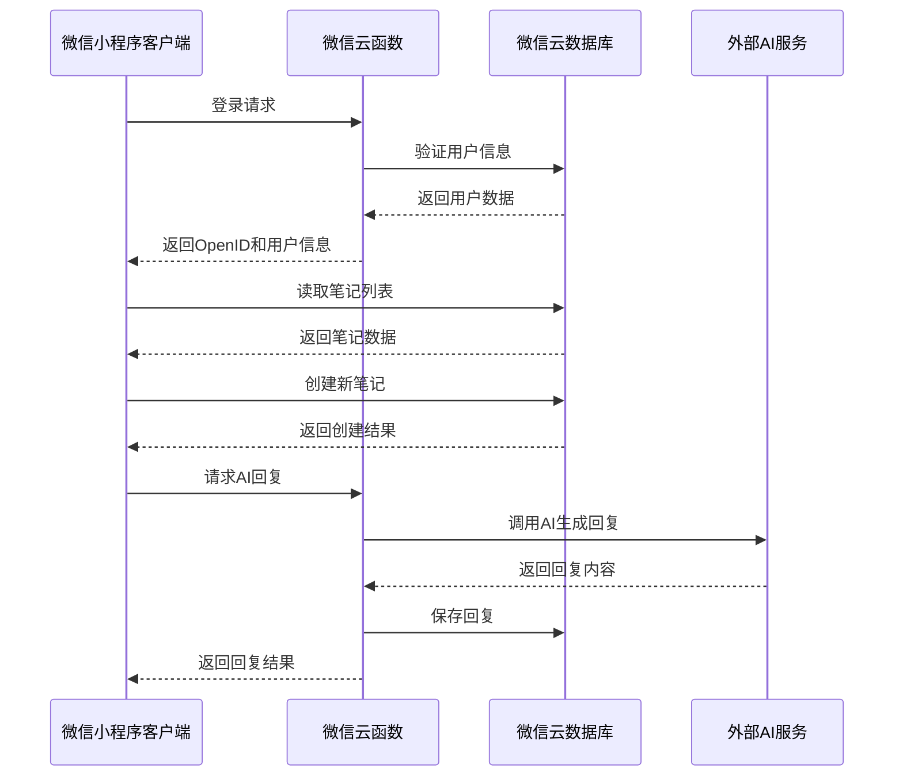
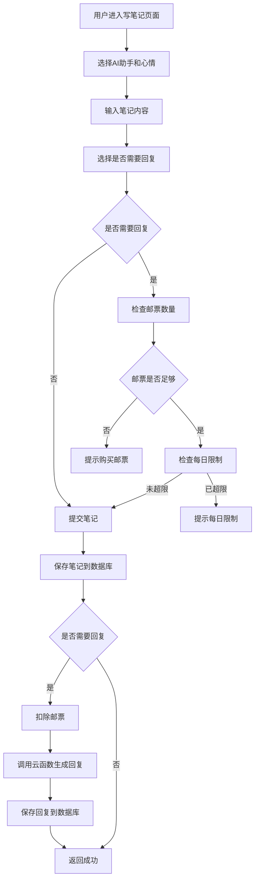
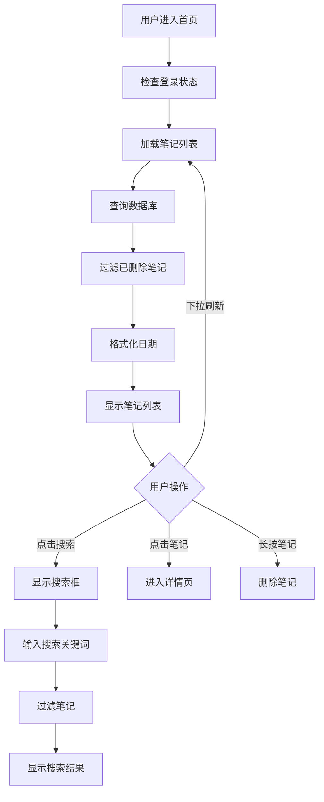
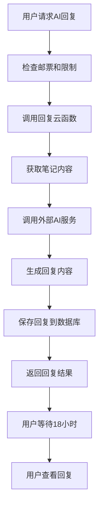

# 个人笔记微信小程序技术架构分析文档

## 1. 文档概述

本文档旨在对个人笔记微信小程序的技术架构进行全面分析和说明，为开发团队提供统一的技术指导。文档涵盖系统架构、技术选型、核心模块设计、数据流程、接口规范、性能优化及安全考量等关键技术要点，确保开发团队对项目技术架构有深入理解，为后续的开发、测试和维护工作提供明确指引。

### 1.1 文档目的
- 提供项目技术架构的全面视图
- 明确技术选型和设计决策
- 指导开发团队进行后续开发工作
- 为测试和维护提供技术参考

### 1.2 适用范围
- 个人笔记微信小程序开发团队
- 项目管理人员
- 测试人员
- 维护人员

## 2. 系统架构

### 2.1 整体架构图



### 2.2 架构层次

| 层次 | 组件 | 职责 | 技术实现 |
|------|------|------|----------|
| 前端层 | 微信小程序页面 | 用户界面展示、交互处理 | 微信小程序原生框架 |
| 前端层 | 自定义组件 | 可复用UI组件 | 微信小程序组件化开发 |
| 业务逻辑层 | 页面逻辑 | 业务流程处理 | JavaScript |
| 业务逻辑层 | 云函数 | 后端业务逻辑处理 | Node.js |
| 数据层 | 云数据库 | 数据存储和查询 | 微信云数据库 |
| 外部服务 | AI服务 | 生成AI回复 | DeepSeek API |

### 2.3 技术栈选型

| 类别 | 技术/框架 | 版本 | 选型理由 |
|------|-----------|------|----------|
| 前端框架 | 微信小程序原生 | 3.7.1 | 官方推荐，性能优异，生态成熟 |
| 云服务 | 微信云开发 | - | 无需搭建后端服务器，快速开发 |
| 数据库 | 微信云数据库 | - | 基于MongoDB，NoSQL结构灵活，适合笔记类应用 |
| 认证方式 | 微信登录 | - | 无缝集成微信生态，用户体验好 |
| 数据可视化 | 自定义组件 | - | 轻量级，按需定制 |
| AI服务 | DeepSeek API | - | 提供高质量的文本生成能力 |

## 3. 核心模块设计

### 3.1 模块划分

| 模块 | 主要功能 | 关键页面 | 核心文件 |
|------|----------|----------|----------|
| 登录认证模块 | 用户身份认证、登录状态管理 | login | `pages/login/login.js` |
| 笔记管理模块 | 笔记的创建、查询、更新、删除 | index, write, detail | `pages/index/index.js`, `pages/write/write.js`, `pages/detail/detail.js` |
| AI回复模块 | 生成和展示AI回复 | write, detail | `pages/write/write.js`, `cloudfunctions/replyToLetter/index.js` |
| 邮票管理模块 | 邮票的管理和购买 | stamps | `pages/stamps/stamps.js` |
| 回收站模块 | 笔记的恢复和永久删除 | trash | `pages/trash/trash.js` |
| 工具模块 | 数据库操作封装 | - | `utils/cloudbaseUtil.js` |

### 3.2 登录认证模块

**功能描述**：负责用户身份认证和登录状态管理，是整个应用的入口点。

**核心流程**：
1. 检查本地存储的登录状态
2. 调用微信登录API获取用户信息
3. 调用云函数获取用户OpenID
4. 将用户信息和OpenID存储到本地
5. 同步用户信息到数据库

**数据结构**：
- 本地存储：`userInfo`（用户信息）、`openid`（用户唯一标识）、`isFirstLogin`（首次登录标记）
- 数据库：`users`集合存储用户信息

**关键接口**：
- `wx.getUserProfile()`：获取用户信息
- `wx.cloud.callFunction({ name: 'login' })`：调用登录云函数

### 3.3 笔记管理模块

**功能描述**：核心业务模块，负责笔记的创建、查询、更新和删除。

**核心流程**：
1. 笔记列表展示（支持下拉刷新）
2. 笔记搜索和筛选
3. 笔记创建（包含字数限制和模板功能）
4. 笔记详情查看
5. 笔记删除（软删除到回收站）

**数据结构**：
- 数据库：`letters`集合存储笔记信息

**关键接口**：
- `cloudbaseUtil.query()`：查询笔记列表
- `cloudbaseUtil.add()`：创建新笔记
- `cloudbaseUtil.update()`：更新笔记
- `cloudbaseUtil.delete()`：删除笔记

### 3.4 AI回复模块

**功能描述**：AI助手对用户笔记的回复，是应用的特色功能。

**核心流程**：
1. 用户在创建笔记时选择是否需要AI回复
2. 系统检查用户的邮票数量和每日回复限制
3. 扣除邮票并调用云函数生成回复
4. 用户等待18小时后查看回复（模拟AI处理时间）

**数据结构**：
- 数据库：`letters`集合的`replyContent`字段存储回复内容

**关键接口**：
- `wx.cloud.callFunction({ name: 'replyToLetter' })`：调用回复云函数

### 3.5 邮票管理模块

**功能描述**：实现邮票的管理和购买，用于兑换AI回复服务。

**核心流程**：
1. 展示用户当前邮票数量
2. 提供不同套餐的邮票购买
3. 记录邮票使用历史
4. 处理虚拟支付流程

**数据结构**：
- 数据库：`users`集合的`stamps`字段存储邮票数量
- 数据库：`stampHistory`集合存储邮票使用历史

**关键接口**：
- `cloudbaseUtil.update()`：更新邮票数量
- `cloudbaseUtil.add()`：添加邮票使用历史

### 3.6 回收站模块

**功能描述**：管理已删除的笔记，支持恢复和永久删除。

**核心流程**：
1. 展示已删除的笔记列表
2. 支持单个笔记的恢复
3. 支持单个笔记的永久删除
4. 支持清空整个回收站

**数据结构**：
- 数据库：`letters`集合的`deleted`字段标记删除状态

**关键接口**：
- `cloudbaseUtil.query()`：查询已删除笔记
- `cloudbaseUtil.update()`：恢复笔记
- `cloudbaseUtil.delete()`：永久删除笔记

## 4. 数据流程分析

### 4.1 笔记创建流程



### 4.2 笔记查询流程



### 4.3 AI回复流程



## 5. 接口设计规范

### 5.1 前端接口规范

#### 5.1.1 页面跳转规范
- 使用`wx.navigateTo()`进行页面跳转，保留返回栈
- 使用`wx.redirectTo()`进行登录等需要替换当前页面的跳转
- 使用`wx.reLaunch()`进行需要重置整个页面栈的跳转
- 使用`wx.navigateBack()`返回上一页

#### 5.1.2 数据请求规范
- 使用`cloudbaseUtil`封装的方法进行数据库操作
- 统一处理请求状态（loading、success、error）
- 提供友好的错误提示

### 5.2 云函数接口规范

#### 5.2.1 登录云函数
**功能**：获取用户OpenID

**参数**：无

**返回值**：
```javascript
{
  "code": 0, // 0表示成功，非0表示失败
  "data": {
    "openid": "用户OpenID"
  },
  "error": null // 错误信息
}
```

#### 5.2.2 回复云函数
**功能**：生成AI回复

**参数**：
```javascript
{
  "letterId": "笔记ID",
  "mentor": "选择的AI助手",
  "mood": "用户心情",
  "content": "笔记内容"
}
```

**返回值**：
```javascript
{
  "success": true, // true表示成功，false表示失败
  "data": {
    "replyContent": "AI回复内容"
  },
  "error": null // 错误信息
}
```

### 5.3 数据库操作规范

#### 5.3.1 集合命名规范
- 使用小写英文单词
- 使用复数形式
- 如：`letters`, `users`, `stampHistory`

#### 5.3.2 字段命名规范
- 使用小写英文单词
- 多单词使用驼峰命名法
- 如：`createTime`, `replyContent`

#### 5.3.3 操作规范
- 使用`cloudbaseUtil`封装的方法进行操作
- 统一处理错误和异常
- 遵循最小权限原则

## 6. 性能优化策略

### 6.1 前端性能优化

#### 6.1.1 页面加载优化
- 使用`wx.setStorageSync()`缓存用户信息和OpenID
- 实现笔记列表的分页加载
- 使用`scroll-view`的`scroll-with-animation`属性提升滚动体验
- 延迟加载非关键资源

#### 6.1.2 渲染优化
- 使用`wx:if`和`wx:else`条件渲染
- 合理使用`wx:for`和`wx:key`
- 避免在`onLoad`中进行大量数据处理
- 使用虚拟列表处理长列表

#### 6.1.3 网络优化
- 合并请求，减少网络调用次数
- 使用本地缓存减少重复请求
- 合理设置请求超时
- 实现失败重试机制

### 6.2 后端性能优化

#### 6.2.1 云函数优化
- 减少云函数的执行时间
- 优化云函数的代码结构
- 合理使用云函数的缓存机制
- 避免在云函数中进行大量计算

#### 6.2.2 数据库优化
- 为常用查询字段创建索引
- 限制查询返回的数据量
- 使用聚合查询优化统计操作
- 避免全表扫描

### 6.3 内存优化
- 及时释放不再使用的变量
- 避免内存泄漏
- 合理使用闭包
- 优化数据结构

## 7. 安全考量

### 7.1 前端安全

#### 7.1.1 输入验证
- 对用户输入进行严格验证
- 限制输入长度和格式
- 防止XSS攻击

#### 7.1.2 本地存储安全
- 不在本地存储敏感信息
- 对存储的用户信息进行加密
- 定期清理本地存储

### 7.2 后端安全

#### 7.2.1 云函数安全
- 对云函数参数进行验证
- 实现请求频率限制
- 避免在云函数中暴露敏感信息

#### 7.2.2 数据库安全
- 遵循最小权限原则
- 对数据库操作进行权限控制
- 实现数据访问日志

### 7.3 网络安全
- 使用HTTPS协议
- 防止网络请求被篡改
- 实现请求签名验证

### 7.4 数据安全

#### 7.4.1 数据加密
- 对敏感数据进行加密存储
- 实现数据传输加密

#### 7.4.2 数据备份
- 定期备份数据库
- 实现数据恢复机制

#### 7.4.3 数据隐私
- 遵循数据隐私保护法规
- 对用户数据进行匿名化处理
- 明确数据使用范围

## 8. 技术实现细节

### 8.1 自定义组件

#### 8.1.1 侧边菜单组件
**功能**：展示用户信息、热力图和功能入口

**实现**：
- 使用`scroll-view`实现滚动效果
- 集成热力图组件
- 提供关闭回调

#### 8.1.2 热力图组件
**功能**：展示用户的笔记活跃度

**实现**：
- 使用Canvas绘制热力图
- 支持自定义数据和颜色

### 8.2 工具类

#### 8.2.1 CloudBaseUtil
**功能**：封装微信云数据库操作

**核心方法**：
- `query()`：查询集合数据
- `getById()`：查询单条记录
- `add()`：添加新文档
- `update()`：更新文档
- `delete()`：删除文档
- `formatDate()`：日期格式化

### 8.3 云函数

#### 8.3.1 登录云函数
**功能**：获取用户OpenID

**实现**：
- 使用`wx.cloud.getWXContext()`获取用户上下文
- 返回用户OpenID

#### 8.3.2 回复云函数
**功能**：生成AI回复

**实现**：
- 接收笔记信息
- 调用外部AI服务生成回复
- 保存回复到数据库

## 9. 开发与部署流程

### 9.1 开发环境搭建

1. **前置条件**：
   - 微信开发者工具
   - 微信小程序账号
   - 云开发环境

2. **初始化步骤**：
   - 克隆项目代码
   - 在微信开发者工具中导入项目
   - 关联云开发环境
   - 部署云函数

### 9.2 代码管理
- 使用微信开发者工具的版本管理功能
- 建议使用Git进行代码版本控制

### 9.3 部署流程

1. **前端部署**：
   - 在微信开发者工具中上传代码
   - 提交审核
   - 发布上线

2. **云函数部署**：
   - 在微信开发者工具中右键云函数目录
   - 选择"上传并部署"
   - 选择"云端安装依赖"

### 9.4 测试流程
- 使用微信开发者工具的模拟器进行功能测试
- 使用真机调试进行兼容性测试
- 建议编写单元测试和集成测试

## 10. 已知问题与解决方案

### 10.1 已知问题

1. **性能问题**：
   - 笔记列表加载时没有分页，大量笔记可能导致性能下降
   - 回收站清空时使用循环删除，效率较低

2. **用户体验问题**：
   - 写笔记页面字数限制较严格（100字），可能影响用户体验
   - AI回复等待时间固定为18小时，缺少灵活性

3. **功能问题**：
   - 邮票购买功能使用模拟支付，未实现真实支付
   - 热力图数据为随机生成，未与实际笔记数据关联

4. **安全问题**：
   - 部分权限检查在前端进行，存在安全隐患
   - 云函数调用缺少完整的参数验证

### 10.2 解决方案

1. **性能优化方案**：
   - 实现笔记列表的分页加载
   - 使用批量操作优化回收站清空功能
   - 增加笔记内容的缓存机制

2. **用户体验优化方案**：
   - 调整写笔记字数限制，或提供更灵活的限制方式
   - 增加AI回复等待时间的设置选项
   - 优化加载状态和错误提示

3. **功能优化方案**：
   - 集成真实的微信支付功能
   - 实现热力图与实际笔记数据的关联
   - 增加笔记分类和标签功能
   - 实现笔记导出和分享功能

4. **安全优化方案**：
   - 将权限检查逻辑移至云函数
   - 增加云函数参数验证
   - 实现请求频率限制，防止恶意调用

## 11. 未来技术规划

### 11.1 技术迭代计划

1. **V1.0**：基础功能实现
   - 笔记管理
   - AI回复
   - 邮票系统
   - 回收站

2. **V2.0**：功能增强
   - 笔记分类和标签
   - 笔记导出和分享
   - 真实支付集成
   - 数据可视化优化

3. **V3.0**：智能化升级
   - 个性化推荐
   - 数据分析
   - 更智能的AI回复
   - 社区功能

### 11.2 技术选型考虑

- **前端**：考虑引入Taro等跨端框架，支持多端部署
- **后端**：考虑使用Node.js搭建独立后端服务，增强扩展性
- **数据库**：考虑使用MongoDB Atlas等云数据库服务
- **AI**：探索使用更先进的AI模型，提升回复质量
- **DevOps**：引入CI/CD流程，提升开发效率

## 12. 总结

个人笔记微信小程序采用微信云开发技术栈，实现了一个功能完整、特色鲜明的个人笔记应用。通过合理的架构设计和技术选型，应用具有良好的可扩展性和可维护性。

本文档详细分析了应用的技术架构、核心模块、数据流程、接口规范、性能优化和安全考量，为开发团队提供了全面的技术指导。通过遵循本文档的规范和建议，开发团队可以更高效地进行后续开发工作，确保应用的质量和稳定性。

未来，随着技术的不断发展和用户需求的变化，应用可以通过技术迭代和功能增强，为用户提供更优质的服务和体验。